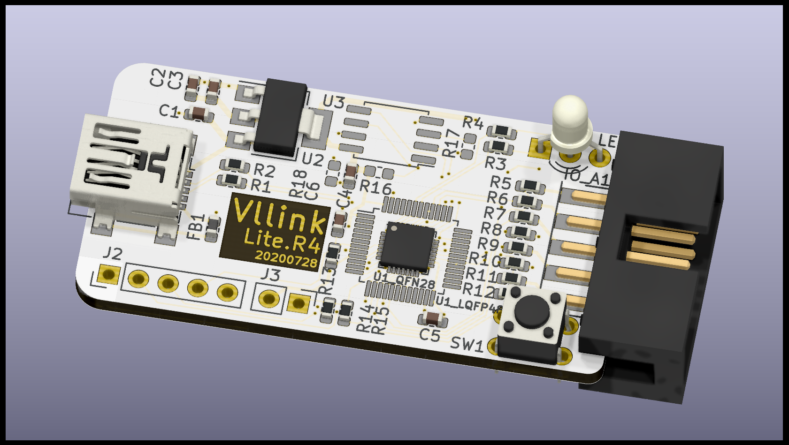
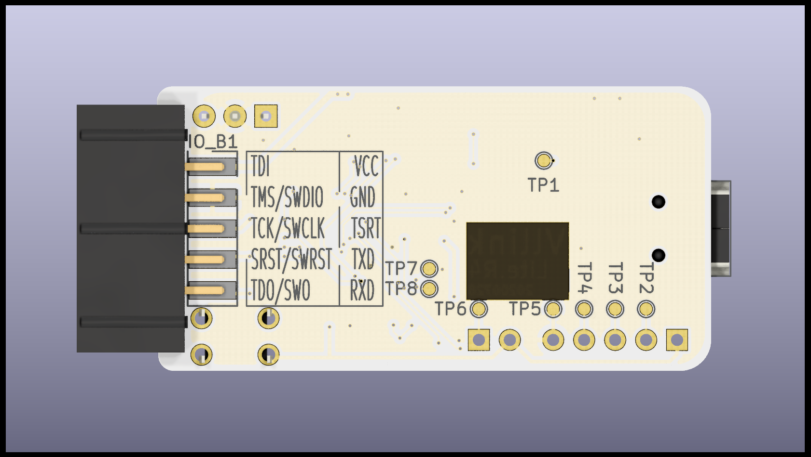
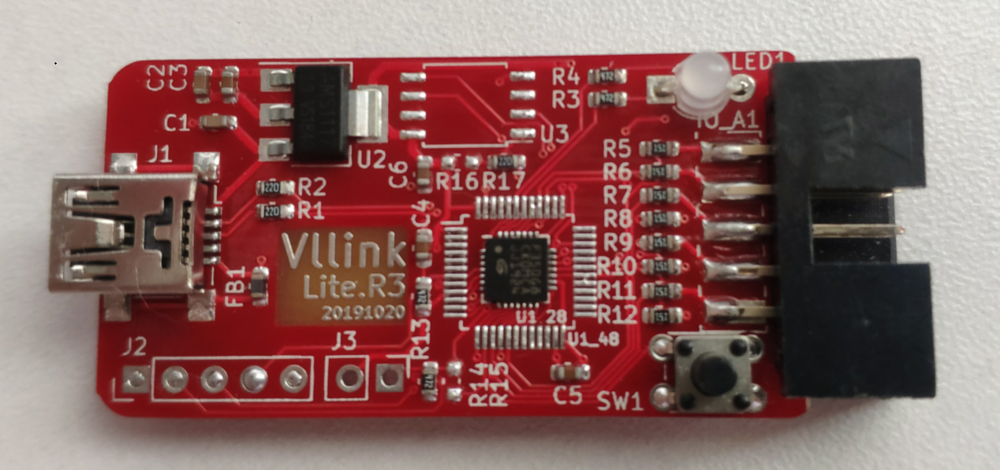
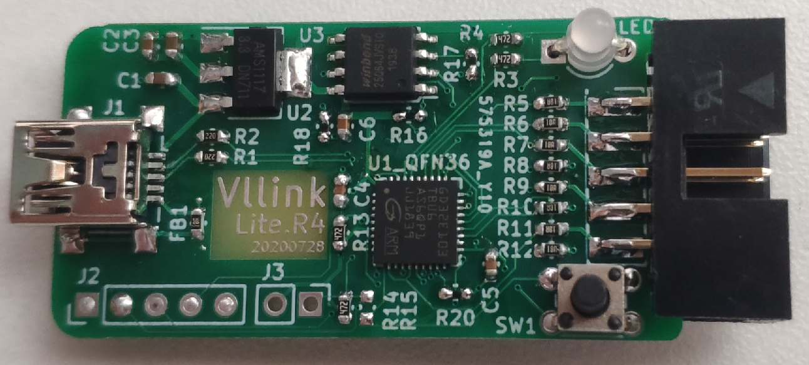

# Vllink Lite

## 简介

Vllink Lite是一款低成本高性能开源调试器。**在PCBA成本控制在￥5.0以内的同时，SWD调试速度可达Jlink V8的125%**。目前调试器主控可选GD32F350G8U6/GD32F350C8T6/GD32E103Tx/GD32E103Cx，并提供对应的硬件图纸。其中GD32E103系列主控拥有更大RAM、ROM，可以集成更多功能。

## 硬件参考设计

### 1. [Vllink Lite.R4.GD32F350xx](https://github.com/vllogic/vllink_lite/tree/master/hardware/vllink_lite.r4.gd32f350xx)
GD32F350G8淘宝零售价格已低于￥3.8，SOF校准免晶振，适合作为成本敏感的集成式调试器。

### 2. [Vllink Lite.R4.GD32E103Tx](https://github.com/vllogic/vllink_lite/tree/master/hardware/vllink_lite.r4.gd32e103tx)
相比GD32F350，提供更大RAM与ROM，预留IO连接SPI Flash。

### 3. [Vllink Lite.R4.GD32E103Cx](https://github.com/vllogic/vllink_lite/tree/master/hardware/vllink_lite.r4.gd32e103cx)
LQFP封装，预留独立SPI连接SPI Flash。

### 仿真及实拍图

## 基本功能

* WEBDFU固件更新，按住按键连接Win10电脑，再使用Chrome浏览器打开更新页面即可 [WebDFU@Github](https://devanlai.github.io/webdfu/dfu-util/)或[WebDFU@Gitee](https://talpachen.gitee.io/webdfu/dfu-util/)
* CMSIS-DAP V2协议（Win10免驱）接口，提供SWD及JTAG接口，已支持IAR for ARM（版本8.32.1及以上）、MDK-ARM（版本5.29及以上）、[PyOCD](https://github.com/mbedmicro/pyOCD)、[OpenOCD](https://github.com/vllogic/openocd_cmsis-dap_v2)。具体配置方式可参看[IDE使用教程](https://github.com/vllogic/vllink_lite/blob/master/doc/ide_guide.md)
* CMSIS-DAP V2的SWO功能，在MDK-ARM下测试可用
* CDC-UART，连接硬件串口：`TXD` `RXD`

## 额外功能（限GD32E103）
* 内置SWD Host、JTAG Host
* 支持RAMIO，即通过调试口访问目标芯片的特定RAM，实现数据交互，类似RTT(J-Link)及Nuconsole(Nu-Link)
* 第二路复用串口，TX:`TRST`、RX:`TDO/SWO`
* CDC-Shell，简易Shell，用以访问第二路串口或者RAMIO

## 调试速度测试

* 优化底层传输协议，尽量使用SPI通讯，IAR默认速率下对SRAM的读写速度可达270KB/S(SWD)或200KB/S(JTAG)，相比DAPLink（CMSIS-DAP V2），大约提升一倍。如果使用优化版的OpenOCD，读写速度可达400KB/s以上。[与主流调试器对比](https://github.com/vllogic/vllink_lite/blob/master/hardware/vllink_lite.r3/speed_test.md)

## 硬件制作

[原理图及PCBA制作资料](https://github.com/vllogic/vllink_lite/tree/master/hardware)

[固件](https://github.com/vllogic/vllink_lite/releases)

## 开发平台

* [Versaloon Software Framework](https://github.com/vsfteam/vsf)
* KiCAD
* IAR for ARM 8.40.2 + [GD32F3x0/GD32E10x AddOn](http://www.gd32mcu.com/cn/download)
* GNU Arm Embedded Toolchain + Cmake + Ninja

## 远景
* 支持简易脚本及自动化配置功能，利用WebUSB接口配合网页端工具，通过载入IAR或Keil的芯片描述文件，自动完成对应芯片的离线编程配置

## 授权
* [Versaloon Software Framework](https://github.com/vsfteam/vsf) `Apache-2.0 License`
* [CMSIS DAP](https://github.com/ARM-software/CMSIS_5) `Apache-2.0 License`
* Other ALL `GPL-3.0 License`

## 交流

欢迎加入QQ群：512256420

## 硬件获得渠道

* JLC 5元打样 + 淘宝买MCU

## 其他

* [CMSIS-DAP V2在Windows 7下使用](https://arm-software.github.io/CMSIS_5/DAP/html/group__DAP__ConfigUSB__gr.html)
