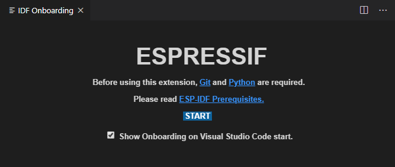
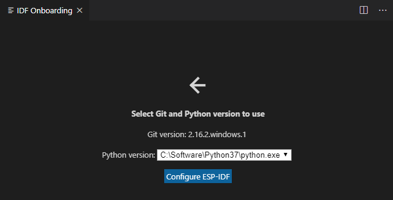
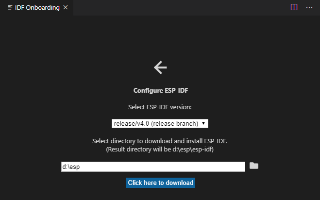
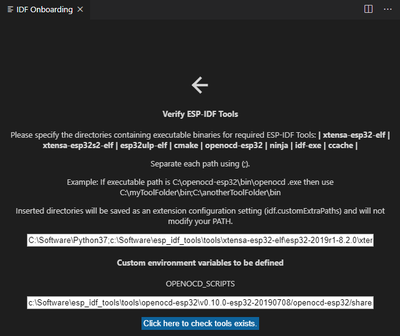
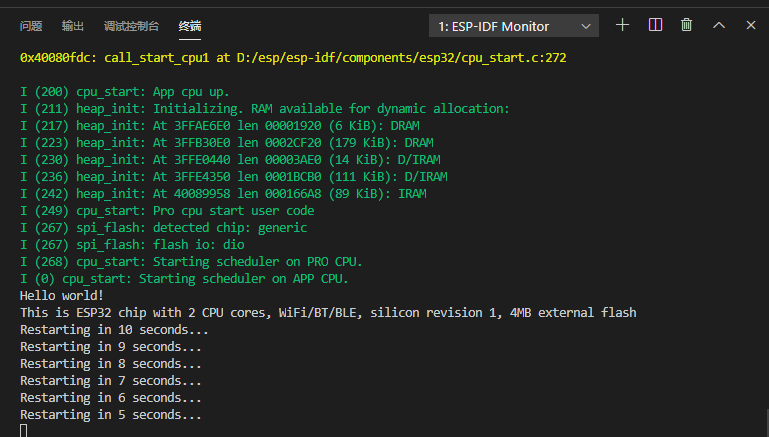
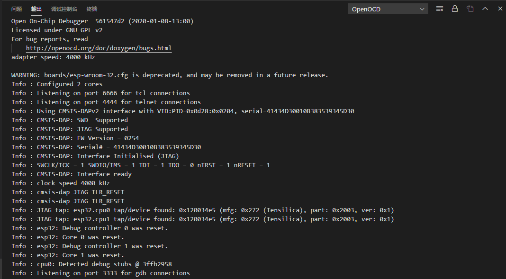
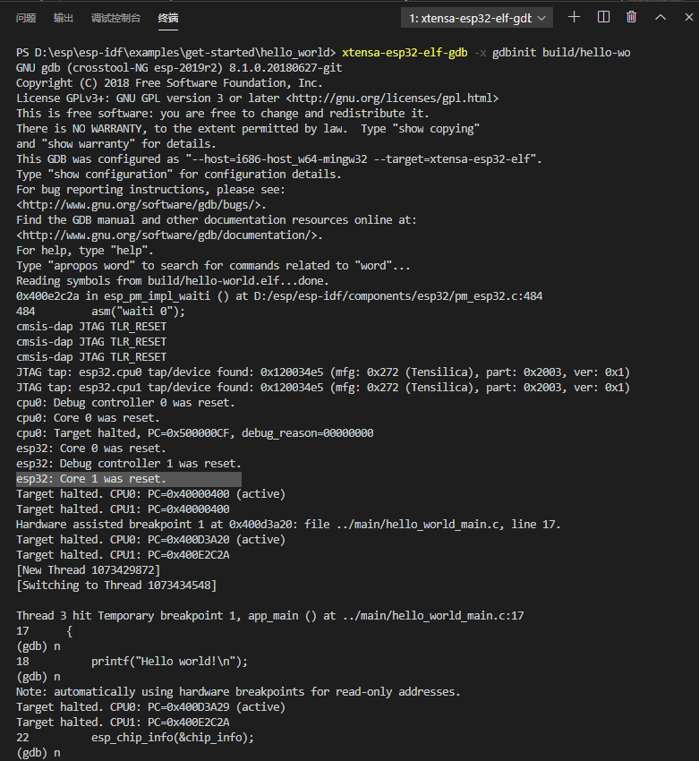

# 在VSCode中使用CMSIS-DAP v2调试ESP32

以Win10为例，Linux下类似

## 所需硬件
1. Vllink Lite
2. esp-wroom-32

## 所需软件
1. VSCode
2. VSCode插件：Espressif IDF
3. Python3.x
4. git
5. OpenOCD-ESP32 (CMSIS-DAP v2兼容) [下载地址](https://github.com/vllogic/openocd_cmsis-dap_v2/releases)

## 注意事项
* 假定系统中已安装好最新版本VSCode、Python3.x及Git，并完成必要配置
* 假定系统对Github，Python库的网络链接速度良好，如果网络较差并且无提速手段，安装体验会非常糟糕

## 安装并配置
1. 下载OpenOCD-ESP32 (CMSIS-DAP v2兼容) ，并解压至`D:\OneDrive\OpenOCD-20200108`
2. 打开VSCode，安装`Espressif IDF`扩展
3. 打开左侧活动栏中的`ESP-IDF Explorer`

   
4. 点击Start

   
5. 自动检测到已安装的Git及Python，点击Configure ESP-IDF

   
6. 此处，选择v4.0版本，并指定目录`d:\esp`
7. 点击Click here to download，等待clone完成
8. 完成后，点击Go to ESP-IDF Tools setup
9.  继续点击Download ESP-IDF Tools
10. 指定目录`C:\Software\esp_idf_tools`，点击Download，继续等待
11. 点击Go to next step

    
12. 先不修改，直接点击Click here to check tools exists
13. 再点Go to next step，提示完成配置，可关闭IDF Onboarding
14. 安装过程完成，相关路径可自行选择，并且后面需要指定这些路径，整个过程大约需要下载600MB数据

## 编译、下载及运行例程
1. 打开例程文件夹`D:\esp\esp-idf\examples\get-started\hello_world`
2. 按快捷键F1，执行`ESP-IDF:Build your project.` 稍等片刻，完成编译
3. 将Vllink Lite外部串口与esp-wroom-32连接（注意：目前[Vllink Lite v0.4](https://github.com/vllogic/vllink_lite/releases/tag/v0.4)的CDC串口不兼容此环境，可先用其他USB串口工具，或直接用JTAG下载）
4. 执行`ESP-IDF:Select port to use.`，选择Vllink Lite的USBCDC串口
5. 执行`ESP-IDF:Flash your project.`，并将ESP32目标板进入下载模式
6. 执行`ESP-IDF:Monitor your device.`，并将ESP32目标板进入运行模式

   

## 命令行调试

由于SDK中的OpenOCD不支持CMSIS-DAP v2，需要先修改一些调试配置

1. 进入`文件 -> 首选项 -> 设置`，选择工作区，在右上角打开json文件，增加如下配置： 
   ```
    "idf.deviceInterface": "interface/cmsis-dap.cfg",
    "idf.deviceInterfaceWin": "interface\\cmsis-dap.cfg",
    "idf.board": "board/esp-wroom-32.cfg",
    "idf.boardWin": "board\\esp-wroom-32.cfg",
    "idf.projectName": "hello-world",
    "idf.showOnboardingOnInit": false,
    ```
2. 选择用户，在右上角打开json文件，将其中的
   ```
   "idf.customExtraPaths": "C:\\Software\\Python37;C:\\Software\\esp_idf_tools\\tools\\xtensa-esp32-elf\\esp-2019r2-8.2.0\\xtensa-esp32-elf\\bin;C:\\Software\\esp_idf_tools\\tools\\esp32ulp-elf\\2.28.51.20170517\\esp32ulp-elf-binutils\\bin;C:\\Software\\esp_idf_tools\\tools\\cmake\\3.13.4\\bin;C:\\Software\\esp_idf_tools\\tools\\openocd-esp32\\v0.10.0-esp32-20190313\\openocd-esp32\\bin;C:\\Software\\esp_idf_tools\\tools\\mconf\\v4.6.0.0-idf-20190628;C:\\Software\\esp_idf_tools\\tools\\ninja\\1.9.0;C:\\Software\\esp_idf_tools\\tools\\idf-exe\\1.0.1;C:\\Software\\esp_idf_tools\\tools\\ccache\\3.7",
   ```
   替换为：
   ```
   "idf.customExtraPaths": "C:\\Software\\Python37;C:\\Software\\esp_idf_tools\\tools\\xtensa-esp32-elf\\esp-2019r2-8.2.0\\xtensa-esp32-elf\\bin;C:\\Software\\esp_idf_tools\\tools\\esp32ulp-elf\\2.28.51.20170517\\esp32ulp-elf-binutils\\bin;C:\\Software\\esp_idf_tools\\tools\\cmake\\3.13.4\\bin;D:\\OneDrive\\OpenOCD-20200108\\bin;C:\\Software\\esp_idf_tools\\tools\\mconf\\v4.6.0.0-idf-20190628;C:\\Software\\esp_idf_tools\\tools\\ninja\\1.9.0;C:\\Software\\esp_idf_tools\\tools\\idf-exe\\1.0.1;C:\\Software\\esp_idf_tools\\tools\\ccache\\3.7",
   ```
3. 由于需要在终端中测试调试效果，可将gdb所在文件夹加入PATH `C:\Software\esp_idf_tools\tools\xtensa-esp32-elf\esp-2019r2-8.2.0\xtensa-esp32-elf\bin`
4. 重启VSCode
5. 执行`ESP-IDF:OpenOCD Manager.` 选择Start OpenOCD

   
6. 建立GDB初始化脚本：gdbinit，内容：
   ```
   target remote :3333
   set remote hardware-watchpoint-limit 2
   mon reset halt
   flushregs
   thb app_main
   c
   ```
7. 在终端中运行：`xtensa-esp32-elf-gdb -x gdbinit build/hello-world.elf`

   

## 图形化调试

TODO
