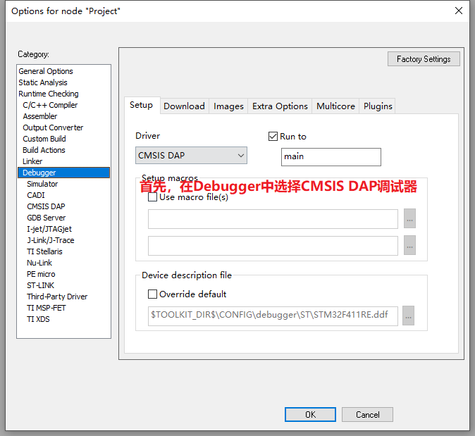
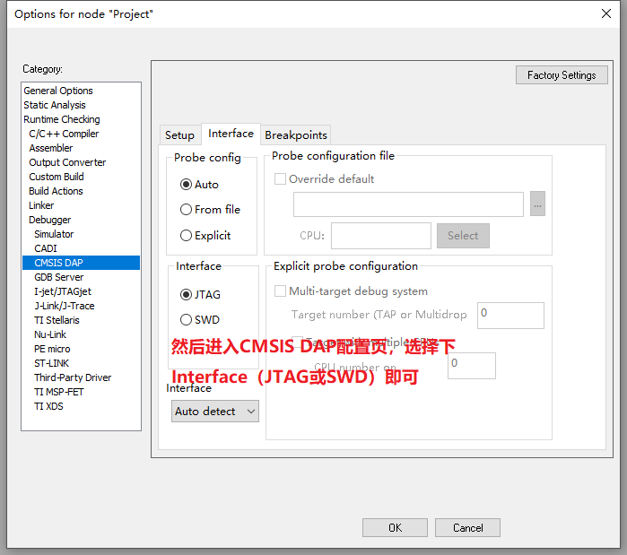
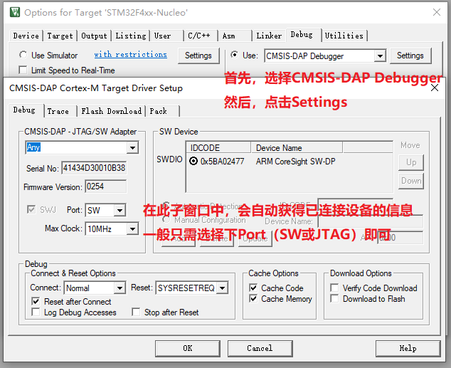
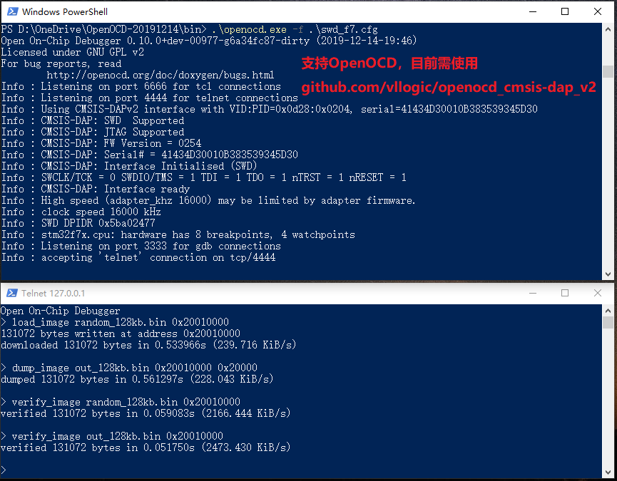
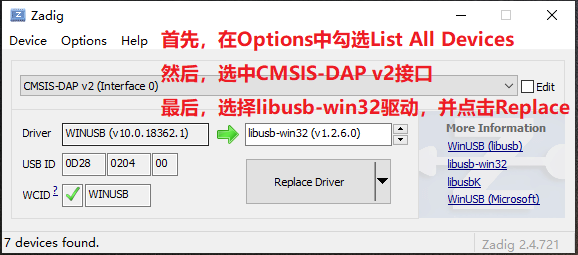
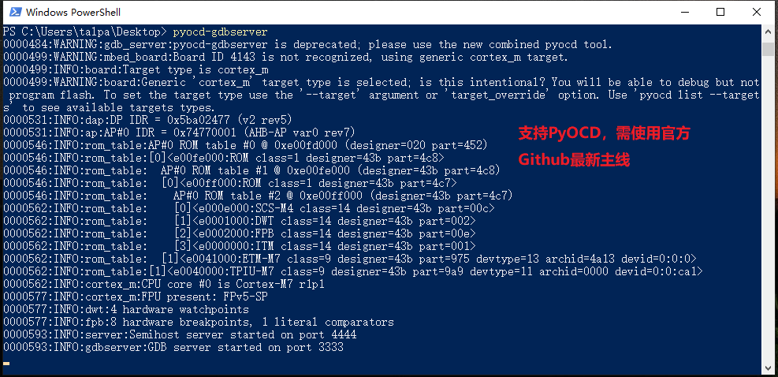

# 调试器HOST端软件配置使用方法

## 说明

本教程仅考虑Windows 10环境

## IAR

* 适用版本：IAR for ARM 8.32.1及以上
* 配置方式：
    
    

## MDK
* 适用版本：MDK-ARM 5.29及以上
* 配置方式：
    

## OpenOCD
* 适用版本：增加CMSIS-DAP v2协议支持的版本，[下载地址](https://github.com/vllogic/openocd_cmsis-dap_v2/releases)
* 配置方式：
    

## PyOCD
* 适用版本：官方Github最新主线代码，[代码地址](https://github.com/mbedmicro/pyOCD)，可用此命令安装：`pip install --pre -U https://github.com/mbedmicro/pyOCD/archive/master.zip`
* 配置方式：需用zadig安装libusb驱动，[zadig下载地址](https://zadig.akeo.ie/)
    
    
